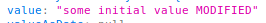

# property and event binding

## pure HTML input

Attributes :

Properties :

https://developer.mozilla.org/en-US/docs/Web/API/HTMLElement

https://developer.mozilla.org/en-US/docs/Web/API/HTMLElement/input_event

https://developer.mozilla.org/fr/docs/Web/API/HTMLInputElement

# Angular

